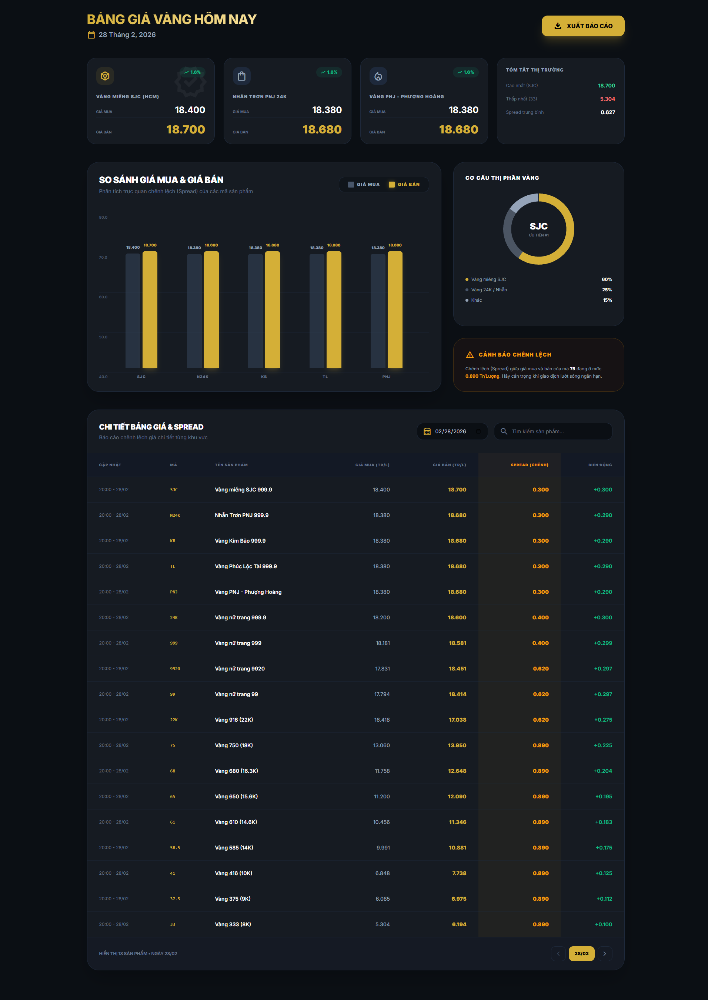

# Automatic Gold Price

Automatic Gold Price is a lightweight system that automatically
collects, processes, and publishes gold price data without requiring a
dedicated backend server.

## Project Idea

This project idea is inspired by:

https://github.com/HyTruongUTE/HyTruong_GoldPrices

The main idea is to automate gold price data collection and publish
analytical reports using only GitHub infrastructure.

Instead of deploying and maintaining a server, this project leverages:

-   GitHub Actions to crawl and update data on a schedule
-   GitHub Pages to host a static website for viewing reports and
    analysis

## Key Advantages

1.  No dedicated server required\
    Data crawling runs entirely on GitHub Actions.

2.  Fully automated workflow\
    Scheduled jobs update the dataset automatically.

3.  Free static hosting\
    GitHub Pages serves the dashboard and reports.

4.  Easy to fork and customize\
    Anyone can fork the repository and enable their own automation
    pipeline.

## How It Works

1.  GitHub Actions runs on a schedule (cron job).
2.  The workflow crawls gold price data from public sources.
3.  The data is stored in `data/gold_price.csv`.
4.  The static website (`index.html` + `app.js`) reads the CSV file.
5.  GitHub Pages publishes the dashboard.

## Repository Structure

```
automatic-gold-price/
├── .github/
│   └── workflows/
│       └── crawl.yml          # GitHub Action workflow
├── data/
│   └── gold_price.csv         # Collected gold price dataset
├── index.html                 # Static dashboard page
├── app.js                     # Frontend logic
└── README.md                  # Project documentation
```

## Deployment

To deploy:

1.  Fork this repository.

2.  Enable GitHub Actions.

3.  Configure the workflow schedule if needed.

4.  Enable GitHub Pages in repository settings.

5.  Access your dashboard via:

    https://`<your-username>`.github.io/automatic-gold-price

## Live Demo
**Dashboard:** [https://daley12306.github.io/automatic-gold-price](https://daley12306.github.io/automatic-gold-price)



## License

MIT License
